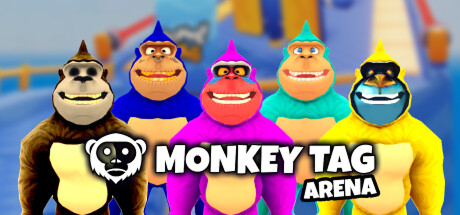
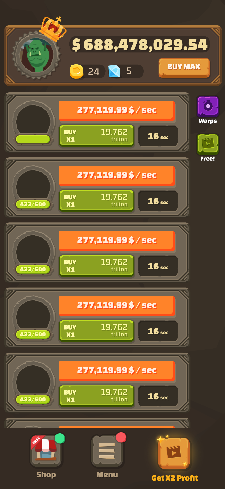

# Victor Cosiuga — Game Development Portfolio

**Unity Developer · 3D Artist · Game Designer**

I build gameplay systems, vehicle physics, procedural tools, UI, technical art, and stylized 3D environments in Unity.

This repository contains selected project case studies. Each project page is designed to work as a fast visual overview, with room for screenshots, diagrams, SVGs, GIFs, and full PDF case studies exported from Figma.

## Selected Projects

### [Touge Drift](projects/touge-drift/README.md)

Stylized touge racing project focused on vehicle handling, gameplay systems, procedural road generation, camera systems, UI, and 3D production.

**Focus:** Unity · C# · Vehicle Physics · Procedural Generation · Game Design · 3D Art

[View project →](projects/touge-drift/README.md)
[Follow on Instagram →](https://www.instagram.com/tougedriftgame/)

---

### [Monkey Tag](projects/monkey-tag/README.md)

Project case study covering my contribution, visual work, gameplay work, tools, and production material.

**Focus:** Unity · Game Development · 3D Art · UI/UX

[View project →](projects/monkey-tag/README.md)

---

### [Capitalist](projects/capitalist/README.md)

Project case study covering my contribution, game systems, visual work, and production material.

**Focus:** Unity · Game Development · 3D Art · UI/UX

[View project →](projects/capitalist/README.md)

---

## About

I am a Unity developer and 3D artist with 10+ years of experience working across gameplay, tools, physics, UI/UX, shaders, technical art, and asset production.

My work usually sits between engineering and art: I like building systems that are practical for production while keeping direct control over how the final game looks and feels.

---

## Social

YouTube: [FunboosterGames](https://www.youtube.com/@FunboosterGames)
Itch.io: [FunboosterGames](https://funboostergames.itch.io/)
Instagram: [TougeDriftGame](https://www.instagram.com/tougedriftgame/)
Assetstore: [FunboosterGames](https://assetstore.unity.com/publishers/96288)

## Contact
GitHub: [@cosiugavictor](https://github.com/cosiugavictor)
