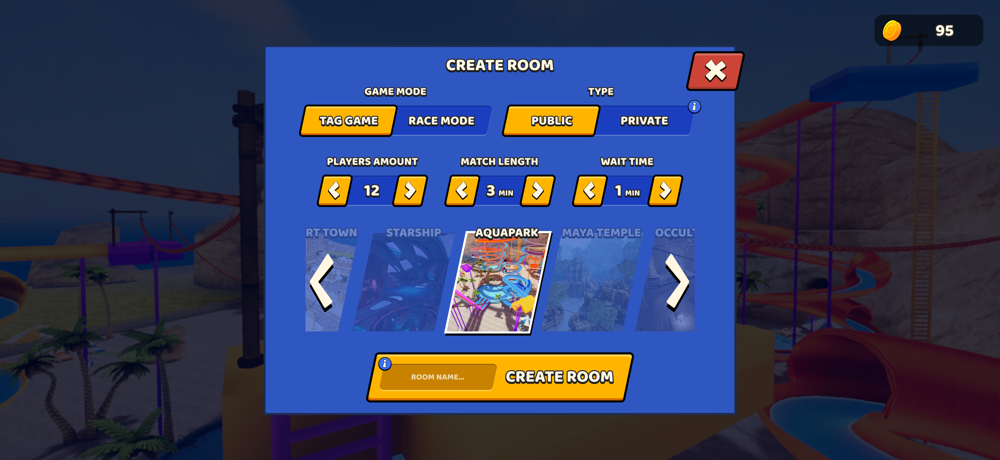
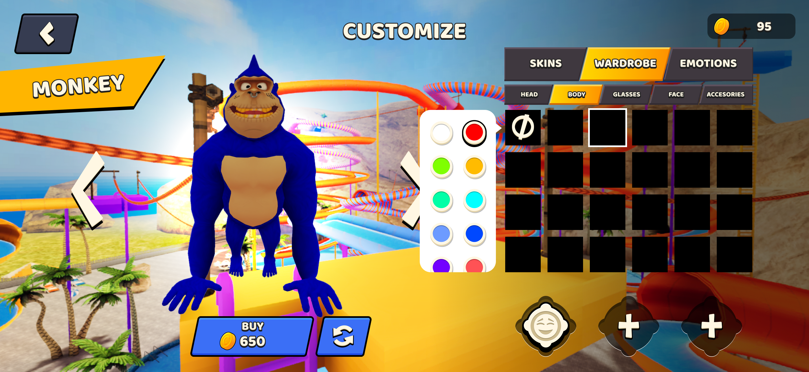
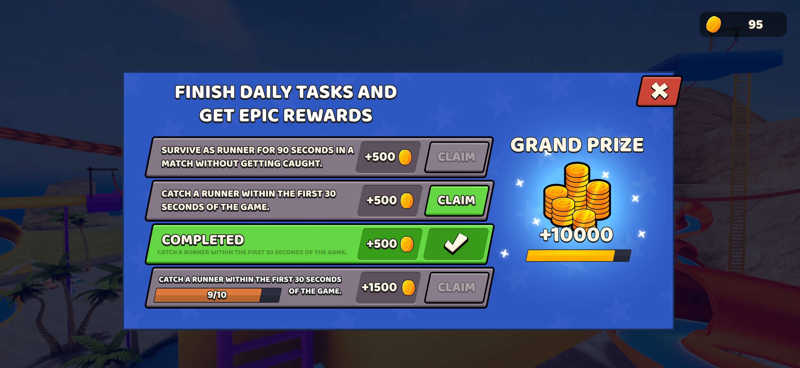
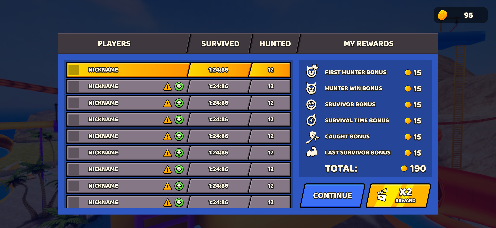
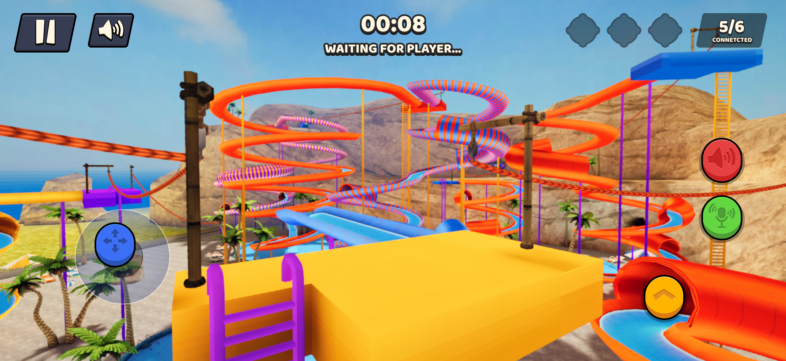
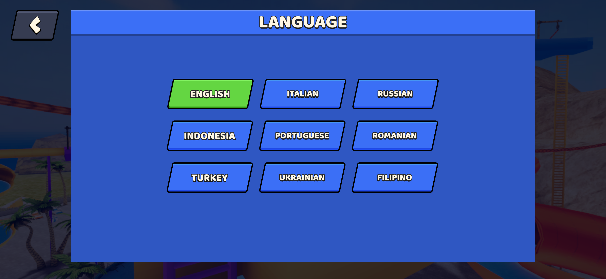
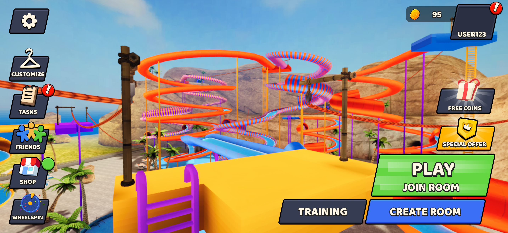
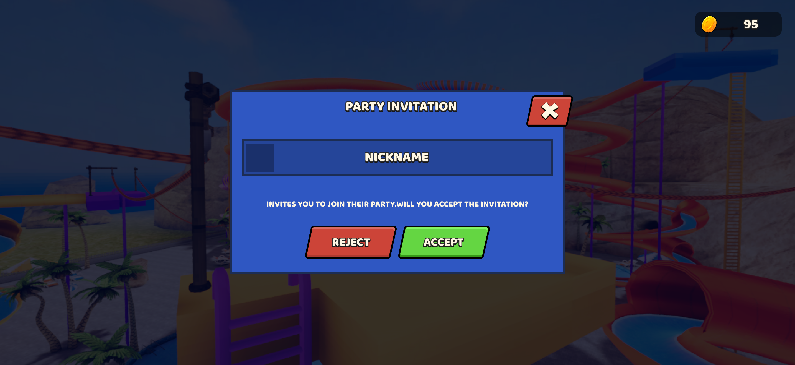
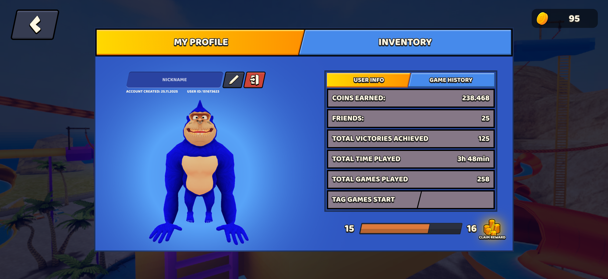
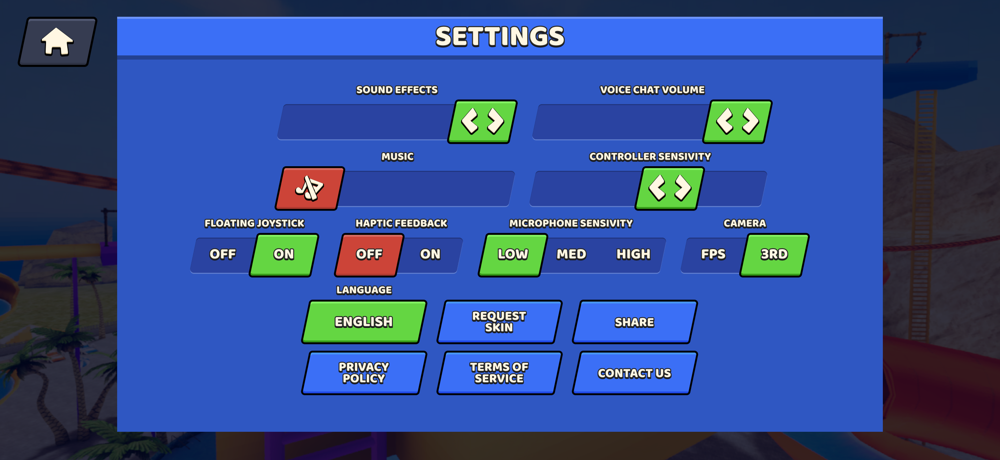

# Monkey Tag

[← Back to portfolio](../../README.md)

## Overview

Monkey Tag is one of the selected projects in my portfolio. This page is prepared as a visual case study for screenshots, production breakdowns, diagrams, and a full PDF exported from Figma.

## My Contribution

Use this section to describe exactly what I worked on in the project.

Suggested format:

- Gameplay / systems
- 3D art
- Environment or character work
- UI / UX
- Tools
- Optimization
- Technical art

## Project Breakdown

### Gameplay / Systems

Add a short explanation of the main gameplay or technical systems I worked on.

### Art & Production

Add selected screenshots and explain the parts I created or implemented.

### Technical Work

Use diagrams, editor screenshots, GIFs, or short notes to show implementation details without exposing proprietary source code.

## Tools & Technology

**Unity · C# · Blender · Figma · Git**

## Gallery

[Open PDF Case Study](documents/monkey-tag-case-study.pdf)

---

[← Back to portfolio](../../README.md)
